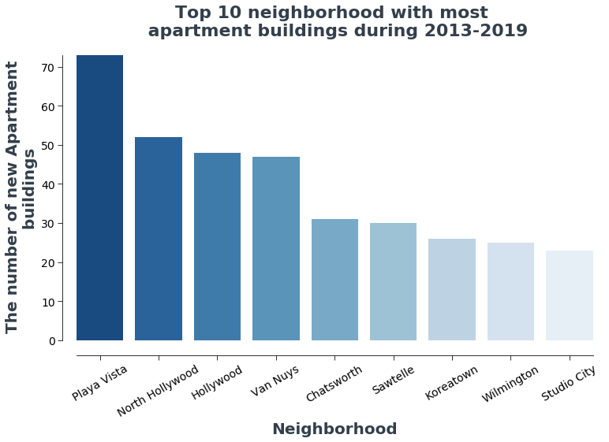

*Submitted by Jane Liang*

# Problem Statement

- Investigate a general trends on housing supply over time. 

- Which neighborhoods provide highest/lowest housing supply?

- Generate choropleth maps to show the change of housing supply from 2013 to 2019

# Dataset Description

["A Certificate of Occupancy"](https://data.lacity.org/A-Safe-City/Building-and-Safety-Certificate-of-Occupancy/3f9m-afei) is a document issued by the Department of Building and Safety certifying a building's compliance with applicable building codes and other laws, and indicating it to be in a condition suitable for occupancy. The data is cleaned for including only building related information and saved as ["Certificates of Occupancy AD Edited -Data.csv"](./Data/Certificates%20of%20Occupancy%20AD%20Edited%20-%20Data.csv) before conducting initial investigation. 

# Key Takeaways:

- The new buildings are mainly 1 or 2 Family Dwelling units.

- The most housing units are provided by Apartment buildings

- The number of housing units increases over time during 2013 to 2016
- In 2017, the lower number of housing units are built than in 2016
- In 2018, the number of housing units increases again

- The most commercial buildings are built in "Downtown" LA
- There are limited number of commercial buildings are constructed during 2013 to present (range from 0 to 12)

- The most Apartment buildings are built in "Playa Vista"

- The most Family Dwellings are built in "Chatsworth"

- The most popular family homes are 2-story home.
- The number of two and three story homes are increasing over time
- The number of one-story homes hasn't increased much over time

# Interactive map

### New buildings at neighborhood level

### New housing units at neighborhood level
.png)

# Future Works:

- Investigate the relationship between prices of housing and housing supply.
- Is the housing supply keep pace with demand(e.g. population growth)?
